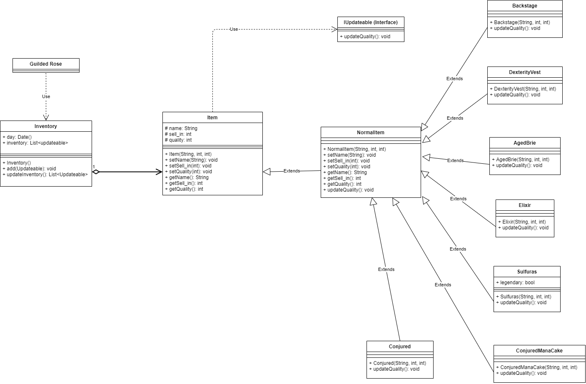
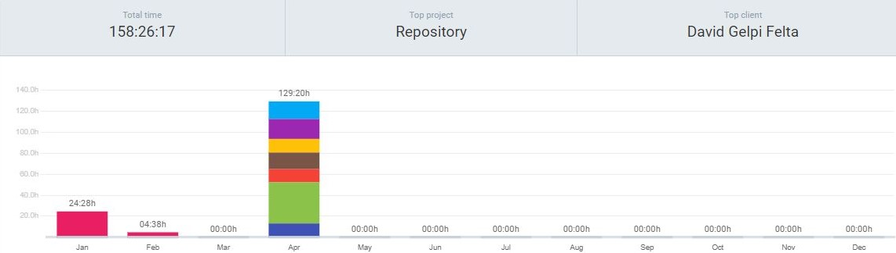
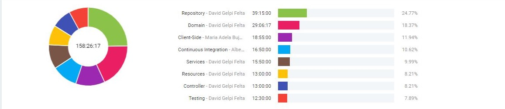

# Ollivanders API-REST

[](https://github.com/pau13-loop/Ollivander_API-REST)
[](https://docs.pytest.org/en/stable/)
[](https://coverage.readthedocs.io/en/coverage-5.5/)
[](https://www.python.org/downloads/)
[](https://flask-restful.readthedocs.io/en/latest/)

> Welcome to the **Ollivanders API
>-REST** project. This is the second
> transversal project for the students of the first year of Web Development. It's based in three fundamental aspects that the three of them will be interconnected to make everything work as desired, the three fundamental sections are:
>
>- A Web Service
>- A Data Base
>- A Web Page
>
> The structure of the connection of
> the sections of this project will be about to create a web service, an api-rest, that keeps a connection with a data base and respond to requests that the users of our api can do from a web page that will be connected.
>
>Do you want to know what makes this project so special and so attractive ? This API-REST has been built with two different data bases, one that follows the relational model, MySQL, and other that doesn't, MongoDB. If you're interested to see how we get that, don't waste your time and give a look to the project, this readme file will give you the perfect introduction to get an idea of what you'll find in this repository.

## Table of Contents

1. [Motivation](#motivation)
1. [Used Technologies](#used-technologies)
1. [Instalation](#instalation)
    * [Manual Installation](#manual-installation)
    * [Automatic Installation](#automatic-installation)
1. [Execute App](#execute-app)
1. [Directory Structure](#directory-structure)
    * [DDD](#ddd)
    * [Client-Side](#client-side)
    * [Controller](#controller)
    * [Docs](#docs)
    * [Domain](#domain)
    * [Repository](#repository)
    * [Resources](#resources)
    * [Services](#services)
    * [Test](#test)
1. [Difficulties](#difficulties)
1. [Reflections](#reflections)
1. [UML Diagram](#uml-diagram)
1. [Clokify](#clokify)
1. [Bibliography](#bibliography)
1. [Documentation](#documentation)
1. [License](#license)
1. [Authors](#authors)

---

## Motivation

The funny thing about the motivation of this project is that we have found so many different ones but the most special and interesting one was get to fully unerstand how the web services that we use every day work. For example the first time that we cretated a dynamic route and realized that by this way was how Facebook display the names of the people on their profile we got so excited. Finally we have finished creating a "complete" web service composed by different sections and connect all of them working with different layers in the design of our application.


The conclusion of this project is that, the web services are AWESOME! They offer you so many different possibilities that give you the chance to create and experiment. The logic that we have been working on hasn't been to complicated to understand but thanks to that we could focus ourselves into the hardest technic concepts.

---

**[⬆ back to top](#table-of-contents)**


## Used Technologies and Developer Tools

#### Used Technologies
- Python
- Flask-restful
- Pytest
- Sphinx
- Pre-commit
- Black
- Coverage
- Tox
- Bandit
- Mongo DB
- SQL DB
- HTML 5
- CSS3
- JavaScript
- Docker
- MarkDown
- Github

#### Developer Tools
- PyCharm
- Visual Studio Code
- Mongo Atlas
- Data Grip
- Postman
- Notion

---

**[⬆ back to top](#table-of-contents)**


## Instalation

### Manual Installation

- Install the virtual environment:

    `$ sudo apt-get install python3.6-venv`

- Make a directory and go to the
 location:

    ```bash
    $ mkdir ./ollivanders
    $ cd ollivanders
    ```

- Clone the project:

    `$ git clone https://github.com/dfleta/api-rest-gildedrose.git`

- Initialize the virtual
 environment and install
  all the dependencies:

    ```bash
    $ python3.6 -m venv venv
    $ source venv/bin/activate
    (venv) $ pip3 install -r requirements.txt
    ```

### Automatic Installation

- Create a directory and go to the
 location:

    ```bash
    $ mkdir ./ollivanders
    $ cd ollivanders
    ```

- Clone the project:

    `git clone https://github.com/dfleta/api-rest-gildedrose.git`

- Initialize the virtual environment
 and activate it.

    ```bash
    $ python3.6 -m venv venv
    $ source venv/bin/activate
    ```

- Install the project:

    `$ pip3 install API_REST_GildedRose-0.0.1-py3-none-any.whl`

---

**[⬆ back to top](#table-of-contents)**


## Execute App

1. First of all you have to create an
account to the mongo Atlas and get a
cluster to be able to connect your
app.  After you have created or
you have done the login into
your account successfully you
can get the url to connect the
app with your data base and go
to the file db_atlas.py to
connect your api.

    ```Python
    connect(
        host='URI')
    ```

2. Activate the virtual environment:

    `$ source venv/bin/activate`

3. Set FLASK environment variables:

    ```Bash
    `$ export FLASK_APP=controller.py`
    `$ export FLASK_EN=development`
    ```
4. Check that you can have
 access to the mongoDB from the
  Atlas Cluster:

    `$ curl portquiz.net:27017`

5. If is the first time that you
initialize this app and you data
base looks empty, initialize and
fill the data base with the command

    `$ flask init-db`

6. Run you app into the local
 host port:

    `$ flask run --host 0.0.0.0`

6. Check on your browser that the api
 is running:
    `http://127.0.0.1:5000/`


## Directory Structure

The architecture of our web service
has been designed in different
layers following the conventions of
the design of web services. This
allows for a clean separation
between types of components and
also helps gather similar
programming code together in one
location. One of the main goals
of the layered architecture is
that they become independent
from one another.

#### DDD

This directory contain all related
with the Domain Driven Design. We
have integrated the first domain
model that we created from the api
and afterwards we made a more
elaborated UML diagram. We think
that the DDD patterns are
really important because helps
you to understand the
complexity in the domain.

#### Client-Side

In this directory we will find all
the files that are related with the
front-end of our web service. And
we have decided to keep the
following directory structure:

###### JS
This directory has all the logic
related with the JavaScript files
that provide diversity of actions to
our web page

###### Static
- img: directory that contains
 all the images that we use for our
  web page

- css: directory that contains the
 files that stylish our web page

#### Controller

This directory it has a single file
that is really important because
without this file we wouldn't be
able to test our web api properly
. This file contains a copy of our
main app file but with a return
statement, this gives us the
chance to test the results.

#### Docs 

Inside this directory you'll find two
different files. One is called
bibliography and it contains all
the links and references to other
projects that we had to check to
get all the needed information
to build our web service. I
hope it will help you on
future projects. 
And the "other file" contains
the dash report from Clokify
, you'll have the chance to
see how much time we invest
doing this project and you can get an
idea of which ones should be the
things to prioritize in future
projects related with web services.

#### Domain

This directory contain all the logic
and by consequent the behaviour of
the objects that will be inside the
data base. Every time you'll have
to update the stock the objects
will have to access to their
logic to know what they have to
do to update their quality and
sell_in.

#### Repository

This directory is the one that create
and keeps a connection with the data
base that our web service is using
during his execution and as well
this directory it has an ORM
model of the objects that will
have to be added into the data
base.

#### Resources

This directory administrate all the
endpoints of the web service. Each
resource is accessed by his
endpoint and each one have a custom
response for each situation.

#### Services

This directory contains just a single
file that is whole function is to
create an intermediate layer
between resources and repository
. This give our application one
more abstraction level. His
functionality is to check the
returned item from the data base.

#### Test

In this directory we have included
all the test cases that we
thought were enough to cover all
the possibilities that we
think that could happen during the
execution of our web service.
This directory as well is
structured into two more
directories:

- test_domain: test the logic that
 operates above the objects that our
  web service manipulate

- test_api: test the logic of our web
 service and that his behaviour is as
  expected

---

**[⬆ back to top](#table-of-contents)**


## Difficulties 

- [x] Connection to the data base
 with multiple users 
 
- [x] Transform to bytes the response
 
- [x] Transform to bytes the response
 
- [x] Implement Continuous
  Integration tools

- [x] Mock data base 

- [x] Create multiple sessions with
  sql alchemy 

- [x] Config conftest to connect
   to a sql data base 
   
- [x] Register and login form
 validation
 
- [x] Fetch GET method with dynamic
endpoints

- [x] Use two data bases with the
 same api-rest 
 
- [ ] Switch user connection
   
- [ ] Implement a shop 

- [ ] Add a wallet for each user

---

**[⬆ back to top](#table-of-contents)**


## Reflections

The reflection about this project is more than positive. How I explained before this was the first REST API that we ever built an has been a bit like a challenge to get all the goals of this project and even improve the minimum requirements. One of the best advices that I can give to the people that want to be involved into a project is to administrate correctly and meticulously the time you have before reaching the goals of the project. This will improve the product you're developing and will keep a high-quality standards.


One of the best things of this project is that how has been made cooperating with the team, we learn so much from the each other and this is one of the best things. Because since the beginning of the project we start to know and get an idea of ​​the different points of view of how this project could be developed. It's surprising how good the relation of the group was from the first day and how many good ideas and advices from the each other we have learn thanks to work hand by hand. After this project I can be sure about how could be the perfect team to work with.


Exactly we have developed an API-REST because it is one of the main things to understand how the web services are built and how they work. Because we can get an idea about how could be implemented or we could know all the theoretical concepts but until you don't try to build one by yourself you don't get an idea about how many things someone should keep in mind, how much preparation and documentation one should get before start the project and how to avoid or go over the typical issues that can appear during the development. We are glad that this project has been proposed because now we feel so much more confident when we talk about web services.


Now looking back and examining the whole process passed we know that we have failed or probably we could have done much better in two main points of this project. One of the things where we failed here is about the time administration. We have spent so much time on details keeping us longer than expected and trying to develop and add new functionalities to our web service that gave the user a big opportunities to experiment and explore instead of improve the functionalities that were already implemented. We have agreed that for the next time we won't repeat the same mistakes and we will considerably improve our skills about how to approach the objectives of a project.


Finally, we think that this project has been really grateful to ourselves both for personal goals and for our professional career. We have learned so many different things about this project and thanks to the good and close relation between the team members we keep a really beautiful memory of our first web service. We still know we have a long way to go but thanks to this project now we move forward with more determination and confidence.

---

**[⬆ back to top](#table-of-contents)**

## UML Diagram



---

**[⬆ back to top](#table-of-contents)**


## Clokify

We will like to share with you our time rates to develop this project. How I said before one of the most important parts of a project is know how administrate your time and prioritize tasks and goals. By these graphics we hope you can get an idea of what we mean. Probably you'll see sections of the project that could be have done much better, and this probably will be reflected on the time we have spent doing this task. We are definitely very happy about the results, but we know with the time we have invested we could have done much more but keep in mind that we are learning, every day, and we like to spent time learning new concepts deeply with the intention to get a good base knowledge and avoid future errors or unless know how to solve them. Clokify is a fantastic tool for developers that want to keep track of their time, and the good point is that is really easy to use. Try it !



---

**[⬆ back to top](#table-of-contents)**


## Bibliography

[Bibliography](./docs/bibliography.md)

---

**[⬆ back to top](#table-of-contents)**


## Documentation

<!--- To post documentation, https://raw.githack.com/ -->
[Documentation Ollivanders-API-REST](https://rawcdn.githack.com/pau13-loop/Ollivanders-API-REST/main/docs/build/html/index.html)

---

**[⬆ back to top](#table-of-contents)**


## License

MIT License

Copyright (c) 2021 Mateo Garcia
 Gonzalez and Pau Llinàs Amat

Permission is hereby granted, free of charge, to any person obtaining a copy
of this software and associated documentation files (the "Software"), to deal
in the Software without restriction, including without limitation the rights
to use, copy, modify, merge, publish, distribute, sublicense, and/or sell
copies of the Software, and to permit persons to whom the Software is
furnished to do so, subject to the following conditions:

The above copyright notice and this permission notice shall be included in all
copies or substantial portions of the Software.

THE SOFTWARE IS PROVIDED "AS IS", WITHOUT WARRANTY OF ANY KIND, EXPRESS OR
IMPLIED, INCLUDING BUT NOT LIMITED TO THE WARRANTIES OF MERCHANTABILITY,
FITNESS FOR A PARTICULAR PURPOSE AND NONINFRINGEMENT. IN NO EVENT SHALL THE
AUTHORS OR COPYRIGHT HOLDERS BE LIABLE FOR ANY CLAIM, DAMAGES OR OTHER
LIABILITY, WHETHER IN AN ACTION OF CONTRACT, TORT OR OTHERWISE, ARISING FROM,
OUT OF OR IN CONNECTION WITH THE SOFTWARE OR THE USE OR OTHER DEALINGS IN THE
SOFTWARE.

---

**[⬆ back to top](#table-of-contents)**


## Authors

- Mateo Garcia Gonzalez
- Pau Llinàs Amat

**[⬆ back to top](#table-of-contents)**
